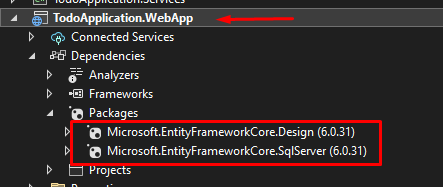
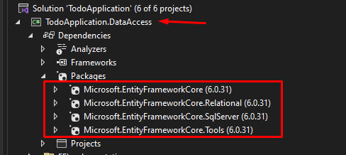

# Entity Framework Setup Guide 📃

### 1. Install EF NuGet packages




### 2. Create and configure DbContext class

### 3. Program.cs configuration

### 4. Migrations

Open the Package Manager Console in Visual Studio <br>

- Navigate to <i>Tools > NuGet Package Manager > Package Manager Console</i> <br>
- Set the Default project to the one where your DbContext is located
- Execute the commands you need

#### Add Migration Command

```cmd
add-migration Init
```

#### Update Database Command

```cmd
update-database
```

#### Rollback Migration Command

```cmd
update-database <Name of Migration>
```
