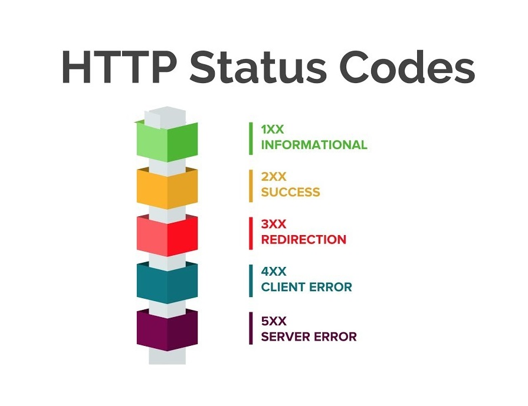

# Building an API and handling Requests 🚌

## Application 🔸

### Controllers and Actions 🔽

Controllers in API are a bit different. This is because they do not need most of the features that the MVC controllers have. This is because they don't need handling and rendering HTML views. In the .NET Full Framework, there is a Controller and an ApiController. The Controller class is for MVC applications and has the features needed to render and handle views for example. The ApiController does not have these features and it also has an automatic serializer/deserializer that can handle data better. In .NET Core, there is no ApiController. The Controller class has all the needed features of both API and MVC controllers. But for building APIs we can use the BaseController which is a basic controller and annotate it with an attribute ApiController. This way we get rid of the MVC features but still have better handling of HTTP requests.

### Routing 🔽

Routing in ASP.NET Core applications is a bit different from the MVC routing. Routing is not done through the default controller but attributes.

#### Controller attribute

```csharp asp
// URL: http://mywebapp.com/api/users
[Route("api/[controller]")]
[ApiController]
public class UsersController : Controller
{
...
}
```

#### Action attributes

```csharp asp
// URL: http://mywebapp.com/api/users ( GET )
[HttpGet]
public ActionResult<IEnumerable<string>> Get()
{
    return new string[] { "Bob", "Jill" };
}

// URL: http://mywebapp.com/api/users/1 ( GET )
[HttpGet("{id}")]
public ActionResult<string> Get(int id)
{
    return "value";
}
```

#### Custom attributes

```csharp asp
// URL: http://mywebapp.com/api/users/1/books ( GET )
[HttpGet("{id}/books")]
public ActionResult<IEnumerable<string>> Books(int id)
{
    return new string[] { "Bob", "Jill" };
}

// URL: http://mywebapp.com/api/users/1/books/2 ( GET )
[HttpGett("{userId}/books/{bookId}")]
public ActionResult<string> dragan(int userId, int bookId)
{
    return $"User: {userId} - Book {bookId}";
}
```

## HTTP Requests and Responses 🔸

HTTP ( Hyper Text Transfer Protocol ) is a protocol that computers use to communicate with each other by sending packets of data. When we use our browser to access a website we tell our machine to contact the server machine through this protocol to request a website. We send a request and the website returns a response. These two machines could be a server and a client machine with a browser, two server machines, a mobile client machine, etc.

### HTTP Methods 🔽

Every request must have a purpose. What does it require of the machine that it is receiving it, get something, add something delete or change? These actions are communicated with HTTP methods. Every time we write a request we must specify first what method would the request use. Some of the most used methods are:

* GET - require some data or information
* POST - insert some new data
* PUT - replace already existing data on the machine
* DELETE - delete already existing data

### Requests 🔽

HTTP Requests and responses consist of two parts:

* Head - All information about the request or response itself goes here as well as some info about limitations and or constraints. This is written first in the request and it contains:
  * Request Line - The first line where we define the HTTP method, URI, and version ( ex: GET /home.html HTTP/1.1 )
  * Other Request Headers - Other data such as:\
    * Host - The server domain name
    * Accept-Language - Language that the client understands
    * User-Agent - what application is sending the request
    * Content-type - The type of data
  
* Body - The body is optional and it contains the data that we need to be sent ( XML, JSON )

#### Example of an HTTP Request GET

```http
GET /hello.htm HTTP/1.1
User-Agent: Mozilla/4.0 (compatible; MSIE5.01; Windows NT)
Host: www.mywebapp.com
Accept-Language: en-us
Connection: Keep-Alive
```

#### Example of an HTTP Request POST

```http
POST /hello.htm HTTP/1.1
Host: www.mywebapp.com
Content-Type: application/json
Content-Length: 205

{
  "users": {
    "firstName": "Bob",
    "lastName": "Bobsky",
    "address": {
      "street": "21 Bob Street",
      "city": "Bob York",
      "postalCode": 101010
    }
  }
}
```

### Responses 🔽

Every time we send a request we get a response. This response consists of an answer from the server. But just because we got an answer does not mean that we got what we requested. An answer can contain the data we requested, can contain an error or information message, or just tell us that the address that we access does not exist. This is communicated with Status Codes. A response consists of:

#### Example of an HTTP Response OK

```http
HTTP/1.1 200 OK
Date: Mon, 27 Jul 2019 12:28:53 GMT
Server: Apache/2.2.14 (Win32)
Last-Modified: Wed, 22 Jul 2019 19:15:56 GMT
Content-Length: 88
Content-Type: text/html
Connection: Closed

<html>  
<body>  
 <h1>Hello, World!</h1>  
</body>  
</html>
```

#### Example of an HTTP Response NOT FOUND

```http
HTTP/1.1 404 Not Found
Date: Sun, 18 Jul 2019 10:36:20 GMT
Server: Apache/2.2.14 (Win32)
Content-Length: 230
Connection: Closed
Content-Type: text/html
```

### Status Codes 🔽

When we send a request to a server we always get some info about what happened with our request. This info is in a form of a Status Code. Status codes represent what happened with our request in a form of a 3-digit number. There are two parts to a status code:

* First digit - Representing the category of the Status
* Other two digits - Representing a specific type result from that category


#### Categories 🔽



### Handling Status Codes in ASP.NET Core 🔽

Status codes are a good way to tell the client what the result of their request would be. We can use status codes in our API applications in our actions. This can be done in multiple ways:

```csharp asp
// Returning only Status Code when there is a problem
[HttpGet("{id}")]
public ActionResult<string> Get(int id)
{
    if(id == 0)
    {
        return NotFound(); // Approach 1
        return StatusCode(StatusCodes.Status404NotFound); // Approach 2
    }
    return _users.GetById(id).Name;
}
```

```csharp asp
// Returning an object with the status code
[HttpGet("{id}")]
public ActionResult<string> Get(int id)
{
    if(id == 0)
    {
        return NotFound(new { message = "Try some other number!", suggestion = 1 });
        return StatusCode(StatusCodes.Status404NotFound, new { message = "Try some other number!", suggestion = 1 });// Approach 2
    }
    return _users.GetById(id).Name;
}
```

### Handling data from Body in ASP.NET Core 🔽

When we receive some data from the client we need to handle it somehow. We can use the **Request** object where we can find all information about the request as well as extract the body data that was sent

```csharp asp
[HttpPost]
public void Post()
{
    using (StreamReader reader = new StreamReader(Request.Body))
    {
        string body = reader.ReadToEnd();
        ...
        ...
    }
    var check = user;
}
```

## Extra Materials 📘

* [Status Codes](https://developer.mozilla.org/en-US/docs/Web/HTTP/Status#Information_responses)
* [HTTP Methods](https://developer.mozilla.org/en-US/docs/Web/HTTP/Methods)
* [What is HTTP](https://developer.mozilla.org/en-US/docs/Web/HTTP/Overview)
